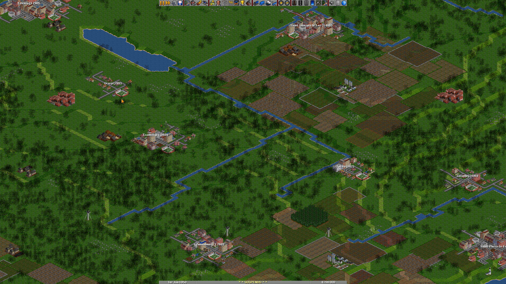

# frenchies-town-names
    
> « Le train TER numéro 98058 à destination de Pontvif va partir. Il desservira les gares de
> Sainte-Foy-le-Grand, Saint-Bonnet-la-Ville, Pontbel, Pignanvilliers, Castelvaux, Écailhé,
> Trauzoc et Pontvif, son terminus. Prenez garde à la fermeture automatique des portes. »

OpenTTD NewGRF for generating French-sounding city names.



Other NewGRFs exist for French city names, but they are all created from a list of *real*
cities in France. I don't find it particularly interesting, so I decided to use a similar
method to how English city names are generated in the game. If you find issues with the
generated names, especially orthographic issues, please report them so I can improve them.

I plan to add some options to generate more regional names, for now you get names that are
believable but are a mix of names from various regions in the same game.

## En français

D'autres NewGRF existent pour jouer avec des noms de villes françaises, mais ils utilisent
tous une liste de noms *réels*. Je ne trouve pas ça très intéressant, alors j'ai décidé
d'utiliser une méthode semblable à celle utilisée par le jeu pour générer des noms en anglais.
Si vous trouvez un problème avec les noms générés, surtout des problèmes d'orthographe, rapportez-le
pour que je puisse améliorer ce NewGRF.

Je compte ajouter plus tard plus d'options pour générer des noms régionaux, mais pour
l'instant vous aurez des noms réalistes mais qui seront des mélanges de plusieurs régions
dans la même partie.

## Build

To build the NewGRF, try this:

```bash
python3 generate.py
```

## License

This NewGRF is distributed under the GPL3+ license. You are free to use, study, copy or modify
it as long as you keep this license and redistribute your modifications.
